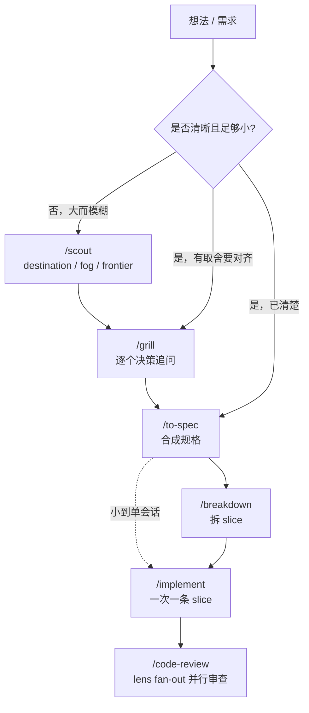

# Agent Skills

可分享的 [Agent Skills](https://agentskills.io/) 集合，用来把软件工作从“想法”推进到“可审查的改动”：

- **工程链**：想法 → 追问/探路 → 写规格 → 拆 slice → 实现 → 审查。
- **Figma 链**：设计稿 → 生产代码 → 视觉 review loop（另见各 skill；本文 Workflow 不展开）。

[](https://skills.sh/wolf-0973/skills)

## 安装

安装全部 skills：

```bash
npx skills add wolf-0973/skills
```

只安装单个 skill：

```bash
npx skills add wolf-0973/skills --skill {skill-name}
```

只安装工程链：

```bash
npx skills add wolf-0973/skills \
  --skill grill --skill scout \
  --skill to-spec --skill breakdown --skill implement --skill code-review --skill tdd
```

## Workflow

单元词汇：

- **investigation**（`/scout` 产出）：一个要回答的决策问题；探路阶段的**理解**单元。
- **slice**（`/breakdown` 产出）：一条端到端、可演示的垂直切片（tracer-bullet）；**交付**单元。
- `frontier` / `fog`：当前可动手的边界 / 还看不清的未知。

**入口判定**

| 情况 | 入口 |
| --- | --- |
| 能讲清问题，但还有关键取舍要拍板 | `/grill` |
| 范围大、未知多，一个会话装不下 | `/scout`（探路后再按需 `/grill`） |
| 已共享理解、可写规格 | 直接 `/to-spec` |



### 推荐顺序

1. `/grill`：能讲清但有关键取舍 → 一轮一问；维护 `CONTEXT.md` / `docs/adr/`。大而模糊、单会话装不下 → 改走 `/scout`。
2. `/scout`：建 map（destination / fog / frontier）；每次只关一条 frontier investigation；雾散尽后进 `/to-spec`。
3. `/to-spec`：合成规格，写 `docs/spec/<slug>.md`。
4. `/breakdown`：把 Feature 规格拆成带 blocking edges 的 slice（每条是 tracer-bullet 垂直切片），写 `docs/slices/<slug>.md`。把 spec seams 写入 slice 的 AC。**spec 小到单会话能做完时可跳过，直接 `/implement`。**
5. `/implement`：**默认一次只做一个已解锁 slice**；仅当用户显式要求才做一组。红→绿垂直切片，不顺手扩范围。
6. `/code-review`：并行 lens fan-out（machine / critical / quality / spec），合并成按 critical → warning → nit 排序的单份报告。Spec lens 默认对照当前 slice / AC（用户指定才审整份 spec）。无定点时审工作区未提交 diff。

上下文建议：`/grill` → `/to-spec` → `/breakdown` 尽量同窗；每个 `/implement` 新开窗口只做一条 slice。Commit 仅在用户明确要求时做。

## 使用口令

```text
/grill
我们要加「导出数据」，先对齐范围。
```

```text
/scout
这个会员系统改造很大，先探路。
```

```text
/to-spec
把刚才对齐的内容写成规格（docs/spec/<slug>.md）。
```

```text
/breakdown
把这份 Feature 规格拆成带阻塞关系的 slice。
```

```text
/implement
做 frontier 上第一条 slice。
```

```text
/code-review
对照当前 slice 的 AC 审查这批改动。
```

## Skill 目录（工程链）

| Skill | 触发方式 | 一句话职责 |
| --- | --- | --- |
| [grill](./skills/grill/SKILL.md) | `/grill`、追问、对齐 | 一次一个决策地追问，沉淀术语和关键 ADR。 |
| [scout](./skills/scout/SKILL.md) | `/scout`、探路、路线图 | 为大而模糊的工作建 map；显式 fog / frontier，产出 investigation。 |
| [to-spec](./skills/to-spec/SKILL.md) | `/to-spec` | 写需求规格（Feature 级）；写 `docs/spec/<slug>.md`。 |
| [breakdown](./skills/breakdown/SKILL.md) | `/breakdown` | 把 Feature 拆成 slice（tracer-bullet + blocking edges）；写 `docs/slices/<slug>.md`。 |
| [implement](./skills/implement/SKILL.md) | `/implement` | 默认一次实现一个已解锁 slice，红→绿垂直切片。 |
| [code-review](./skills/code-review/SKILL.md) | `/code-review`、审核、对照规格审查 | lens fan-out（machine / critical / quality / spec）→ 合并单份 severity 报告；支持定点 diff 或工作区。 |
| [tdd](./skills/tdd/SKILL.md) | `/tdd`、红绿、写测试（可被模型自动调用） | 红→绿循环的横切纪律：好测试、seam、坏味道；`/implement` 与修 bug/重构均可调用。 |

## 产物与回退

长期知识按职责归档：**`CONTEXT.md` 只收术语**，**`docs/adr/` 只收已接受的硬架构决策**；现有 **`AGENTS.md`** 可承接经用户确认的项目级协作规则。其余产物都是临时脚手架，**agent 不自动删，想清理时由用户删**。`<slug>` = 该 Feature / 主题的短横线命名（如 `export-data`）。

<!-- SYNC: 反馈升格门槛的 SSOT 见 skills/code-review/SKILL.md#completion。 -->

| 产物 | 落点 | 维护 |
| --- | --- | --- |
| 术语表（`/grill`） | `CONTEXT.md`（多上下文加 `CONTEXT-MAP.md`） | **长期**，活文档，术语变了就更新 |
| 架构决策 ADR（`/grill`） | `docs/adr/NNNN-<slug>.md` | **长期**，一旦接受不改（要改写新 ADR supersede） |
| 项目级协作规则（`/code-review` 反馈升格） | 现有 `AGENTS.md` | **长期**；仅同类反馈重复且用户明确确认为项目级规则后提议，绝不自动写 |
| 规格（`/to-spec`） | `docs/spec/<slug>.md` | 临时，做完即过期，用户按需删 |
| slice（`/breakdown`） | `docs/slices/<slug>.md` | 临时，同上 |
| 探路图（`/scout`） | `docs/scout/<slug>.md`（多文件用 `docs/scout/<slug>/`） | 临时，雾散尽后决策吸收进规格 / ADR |
| 审查结果（`/code-review`） | 对话内 inline，无文件 | 不落盘 |

- scout investigation 类型 `chore` = 探路手工杂活（开权限、要资料等），**不是** `/breakdown` 产出的 slice。

## MCP

Figma 链所需 MCP 见 `figma-to-code` / `figma-review-phase`。

## License

[MIT](./LICENSE)
