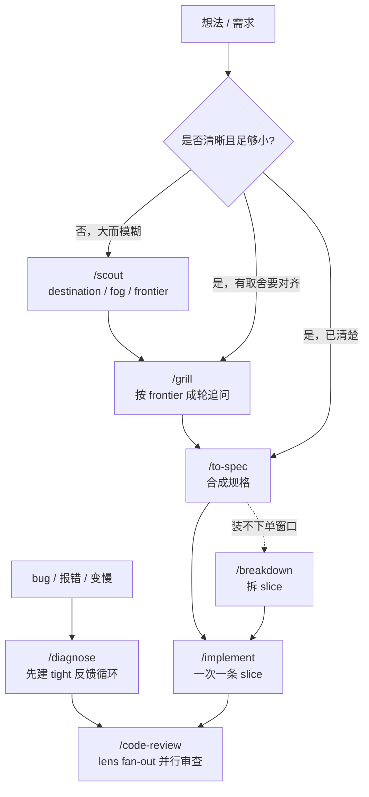

# Agent Skills

可分享的 [Agent Skills](https://agentskills.io/) 集合，用来把软件工作从“想法”推进到“可审查的改动”：

- **工程链**：想法 → 追问/探路 → 写规格 → 拆 slice → 实现 → 审查；bug 走 `/diagnose` 单独入口。
- **Figma 链**：设计稿 → 生产代码 → 视觉 review loop（另见各 skill；本文 Workflow 不展开）。

[](https://skills.sh/wolf-0973/skills)

## 安装

安装全部 skills：

```bash
npx skills add wolf-0973/skills
```

只安装单个 skill：

```bash
npx skills add wolf-0973/skills --skill {skill-name}
```

只安装工程链：

```bash
npx skills add wolf-0973/skills \
  --skill grill --skill scout \
  --skill to-spec --skill breakdown --skill implement --skill code-review \
  --skill tdd --skill diagnose
```

## Workflow

单元词汇：

- **investigation**（`/scout` 产出）：一个要回答的决策问题；探路阶段的**理解**单元。
- **slice**（`/breakdown` 产出）：一条端到端、可演示的垂直切片（tracer-bullet）；**交付**单元。
- **frontier**：依赖已满足、**现在就能动**的那一批——`/grill` 里是前置已拍板的决策（一轮问完），`/scout` 里是 blockers 全 closed 且无人认领的 investigation，`/breakdown`·`/implement` 里是 `Blocked by` 全 done 的 slice。做完一项，边界就往外推一格。
- **fog**：还写不清、连问题都没法精确陈述的未知；在 frontier 之外。判据是「能否精确陈述」，不是「能否回答」。
- **handoff 行**：每个 skill 收尾固定输出 `下一步：/<cmd> · <要带的文件> · <一句状态>`，换窗口时整行贴过去即可。

**入口判定**

| 情况 | 入口 |
| --- | --- |
| 能讲清问题，但还有关键取舍要拍板 | `/grill` |
| 范围大、未知多，一个会话装不下 | `/scout`（探路后再按需 `/grill`） |
| 已共享理解、可写规格 | 直接 `/to-spec` |
| 有东西坏了 / 报错 / 变慢 | `/diagnose`（不走规格链） |



### 节奏

每环的路由写在它自己的 Completion 里（就近生效），这里只给窗口建议：`/grill` → `/to-spec` → `/breakdown` 尽量同窗；每个 `/implement` 新开窗口只做一条 slice，靠 handoff 行 + slice 的 `Status` 接上。

跨会话的连续性只靠三样东西：`CONTEXT.md`（术语 + 已拍板决策）、slice 的 `Status: in progress — <做到哪>`、以及上一环的 handoff 行。对话本身不算记录。

### 校准信号

流程本身也要可证伪。用一段时间后对照三个信号，哪个亮了就塌缩对应环节，别守成公理：

- `/breakdown` 几乎总被跳过 → 把它降级成 `/to-spec` 里的可选步骤。
- `/code-review` 的 quality findings 长期占大头 → 红→绿循环没把该清的清掉，修 `/tdd`·`/implement`，而不是加重 review。
- `/diagnose` 的捷径被频繁误用（跳过定位后修错）→ 收紧捷径判据；反之循环被仪式性照建 → 放宽。

## 使用口令

```text
/grill
我们要加「导出数据」，先对齐范围。
```

```text
/scout
这个会员系统改造很大，先探路。
```

```text
/to-spec
把刚才对齐的内容写成规格（docs/spec/<slug>.md）。
```

```text
/breakdown
把这份 Feature 规格拆成带阻塞关系的 slice。
```

```text
/implement
做 frontier 上第一条 slice。
```

```text
/code-review
对照当前 slice 的 AC 审查这批改动。
```

```text
/diagnose
导出接口偶发 500，先建个能稳定变红的循环。
```

## Skill 目录（工程链）

| Skill | 触发方式 | 一句话职责 |
| --- | --- | --- |
| [grill](./skills/grill/SKILL.md) | `/grill`、追问、对齐 | 按 frontier 成轮追问决策树；术语与闭合决策写进 `CONTEXT.md`。 |
| [scout](./skills/scout/SKILL.md) | `/scout`、探路、路线图 | 为大而模糊的工作建 map；显式 fog / frontier，产出 investigation（research 型可并行）。 |
| [to-spec](./skills/to-spec/SKILL.md) | `/to-spec` | 写需求规格（Feature 级）；写 `docs/spec/<slug>.md`。 |
| [breakdown](./skills/breakdown/SKILL.md) | `/breakdown` | 把 Feature 拆成 slice（tracer-bullet + blocking edges）；写 `docs/slices/<slug>.md`。 |
| [implement](./skills/implement/SKILL.md) | `/implement` | 默认一次实现一个已解锁 slice，红→绿垂直切片；维护 slice `Status`。 |
| [code-review](./skills/code-review/SKILL.md) | `/code-review`、审核、对照规格审查 | lens fan-out（machine / critical / quality / spec）→ critical 证伪复核 → 合并单份 severity 报告；支持定点 diff 或工作区。 |
| [diagnose](./skills/diagnose/SKILL.md) | `/diagnose`、诊断、排查（可被模型自动调用） | 修 bug / 性能回归：先建 tight 且能变红的反馈循环，再最小化、排序假设、下探针、修+回归测试、清场复盘。 |
| [tdd](./skills/tdd/SKILL.md) | `/tdd`、红绿、写测试（可被模型自动调用） | 红→绿循环的横切纪律：好测试、seam、坏味道；`/implement` 与 `/diagnose` 均可调用。 |

## 产物与回退

长期知识按职责归档：**`CONTEXT.md` 收术语与已拍板决策**（各一段，都只写一行以内的定义/决策，不放实现细节）；现有 **`AGENTS.md`** 可承接经用户确认的项目级协作规则。其余产物都是临时脚手架，**agent 不自动删，想清理时由用户删**。`<slug>` = 该 Feature / 主题的短横线命名（如 `export-data`）。

> 与上游 [mattpocock/skills](https://github.com/mattpocock/skills) 的一处刻意分歧：上游把决策记进 `docs/adr/`、`CONTEXT.md` 严格只做术语表。这里合并到 `CONTEXT.md` 的 `## Decisions` 段——单文件、零索引成本，代价是自己守住「不放实现细节」这条。

<!-- SYNC: 反馈升格门槛的 SSOT 见 skills/code-review/SKILL.md#completion。 -->

| 产物 | 落点 | 维护 |
| --- | --- | --- |
| 术语表 + 决策记录（`/grill`） | `CONTEXT.md`（多上下文加 `CONTEXT-MAP.md`） | **长期**，活文档；术语变了就更新，决策被推翻就改写那一行 |
| 项目级协作规则（`/code-review` 反馈升格） | 现有 `AGENTS.md` | **长期**；仅同类问题重复且用户明确确认为项目级规则后提议，以「场景 + 禁止 X，改用 Y」一行落入，绝不自动写 |
| 规格（`/to-spec`） | `docs/spec/<slug>.md` | 临时，做完即过期，用户按需删 |
| slice（`/breakdown`） | `docs/slices/<slug>.md` | 临时，同上 |
| 探路图（`/scout`） | `docs/scout/<slug>.md`（多文件用 `docs/scout/<slug>/`） | 临时，雾散尽后决策吸收进规格 |
| 审查结果（`/code-review`） | 对话内 inline，无文件 | 不落盘 |
| 反馈循环脚本 / 一次性 harness（`/diagnose`） | 临时目录或 `scripts/` | 临时，Completion 要求修完删掉或移到明确标注的调试位置 |

- scout investigation 类型 `chore` = 探路手工杂活（开权限、要资料等），**不是** `/breakdown` 产出的 slice。

## MCP

Figma 链所需 MCP 见 `figma-to-code` / `figma-review-phase`。

## License

[MIT](./LICENSE)
